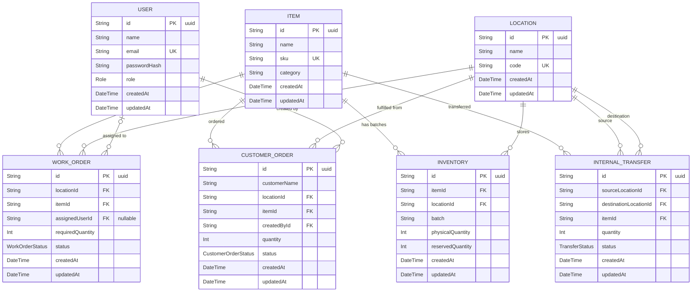

# Mini Operations ERP — Entity Relationship Diagram

Generated from `server/prisma/schema.prisma`.

## Enums

| Enum | Values |
|---|---|
| `Role` | `ADMIN`, `OPERATIONS`, `SALES` |
| `WorkOrderStatus` | `ASSIGNED`, `IN_PROGRESS`, `COMPLETED` |
| `TransferStatus` | `REQUESTED`, `DISPATCHED`, `RECEIVED` |
| `CustomerOrderStatus` | `CREATED`, `RESERVED`, `CANCELLED` |

## ER Diagram

## Relationship Summary

| Relationship | Type | Description |
|---|---|---|
| `Item` → `Inventory` | One-to-Many | One item can have many inventory batches across locations |
| `Location` → `Inventory` | One-to-Many | One location can hold many inventory records |
| `Item` → `WorkOrder` | One-to-Many | One item can appear in many work orders |
| `Location` → `WorkOrder` | One-to-Many | One location can have many work orders |
| `User` → `WorkOrder` | Zero-or-One-to-Many | A user can be optionally assigned to many work orders |
| `Item` → `InternalTransfer` | One-to-Many | One item can be transferred many times |
| `Location` → `InternalTransfer` (source) | One-to-Many | One location can be source of many transfers |
| `Location` → `InternalTransfer` (destination) | One-to-Many | One location can be destination of many transfers |
| `Item` → `CustomerOrder` | One-to-Many | One item can have many customer orders |
| `Location` → `CustomerOrder` | One-to-Many | One location can serve many customer orders |
| `User` → `CustomerOrder` | One-to-Many | One user (SALES) can create many customer orders |

## Unique Constraints

| Model | Constraint |
|---|---|
| `User` | `email` |
| `Location` | `code` |
| `Item` | `sku` |
| `Inventory` | `(itemId, locationId, batch)` — composite unique |

## Notes

- `Inventory.reservedQuantity` is incremented when a `CustomerOrder` is placed and decremented on cancellation. The available quantity is computed as `physicalQuantity − reservedQuantity`.
- `InternalTransfer` uses two named relations (`SourceLocation`, `DestLocation`) on `Location` to distinguish source from destination.
- `WorkOrder.assignedUserId` is nullable — a work order may exist without an assigned user.
- `CustomerOrder` defaults to status `RESERVED` (not `CREATED`) at creation, reflecting that stock reservation happens atomically at order creation time.
